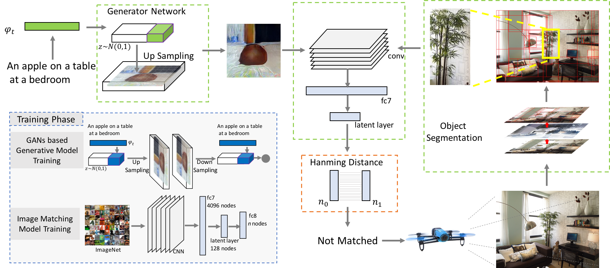
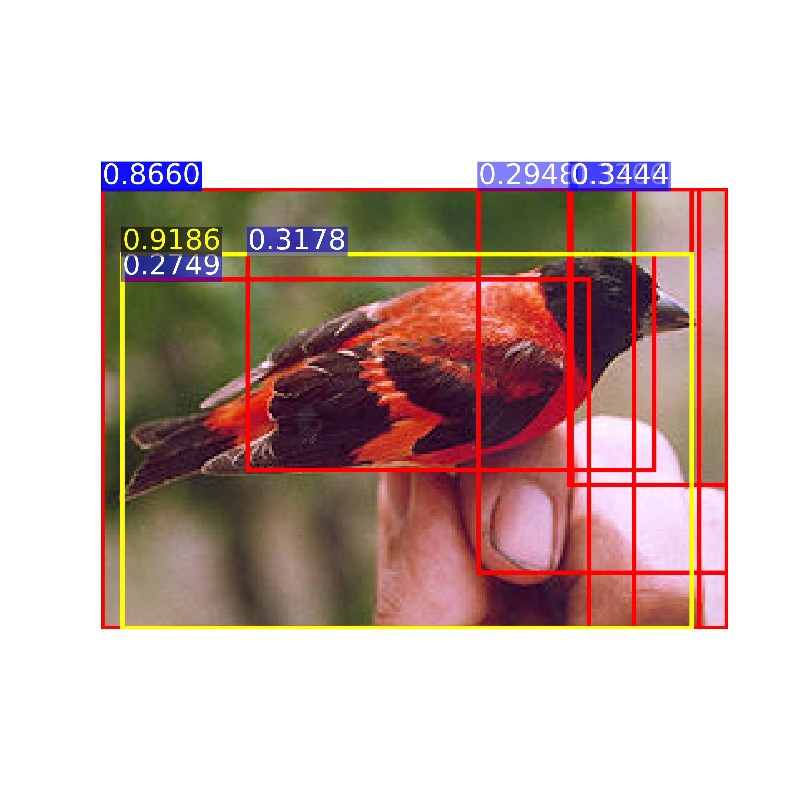
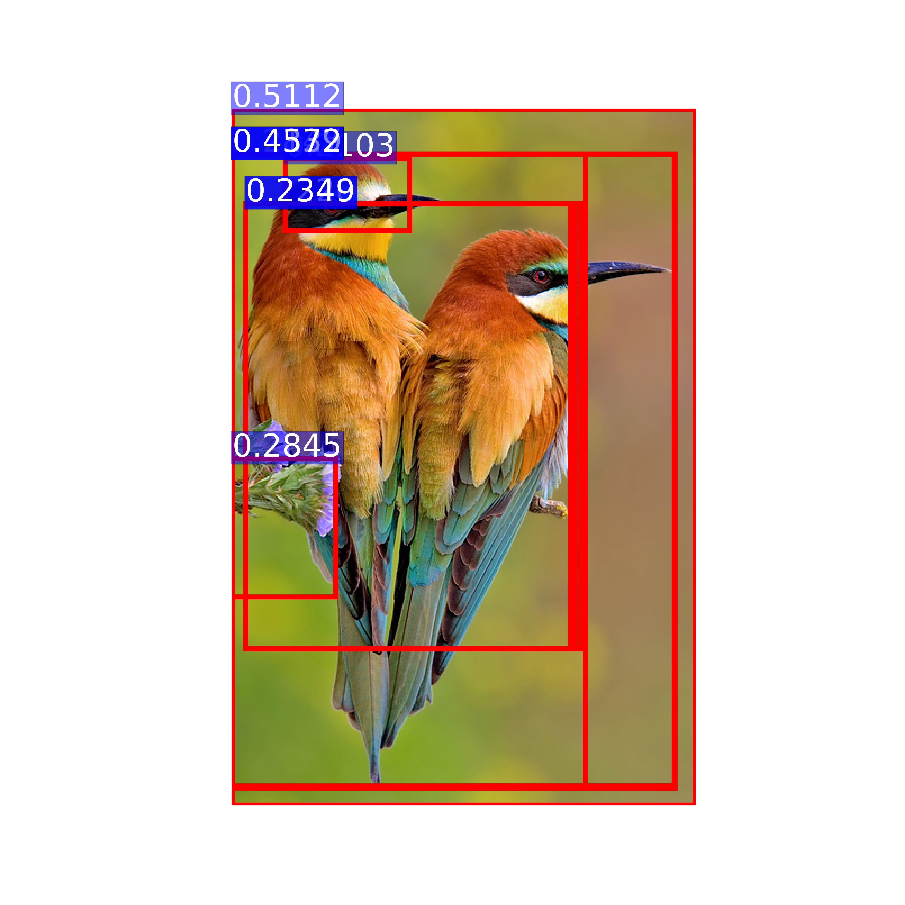
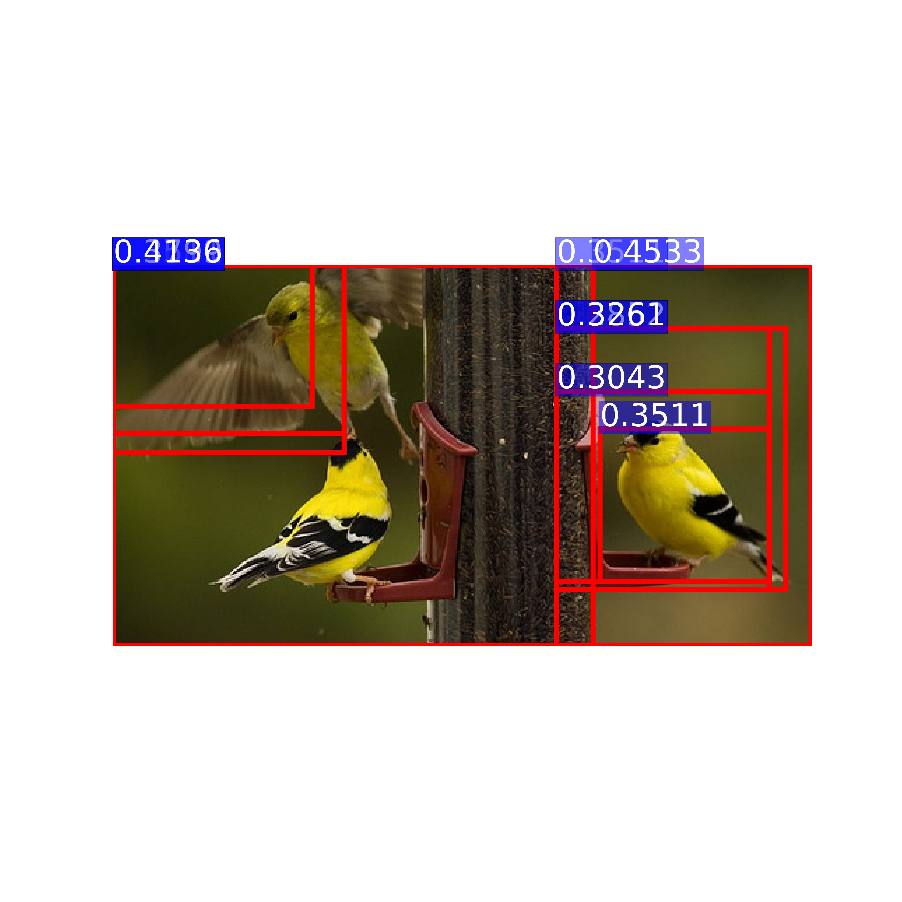
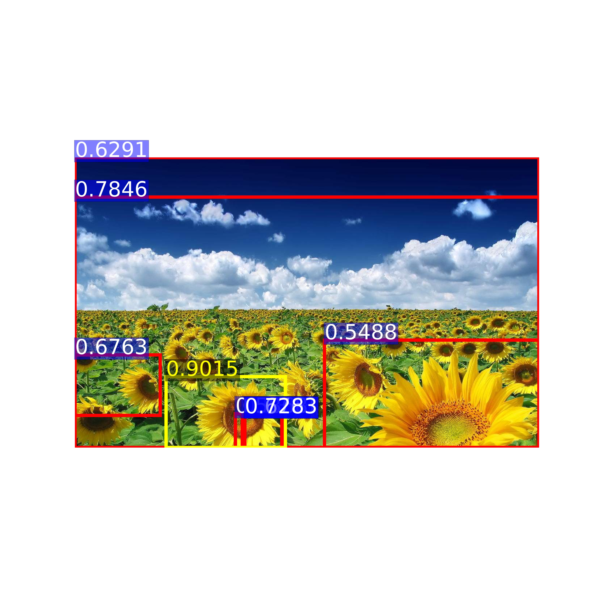
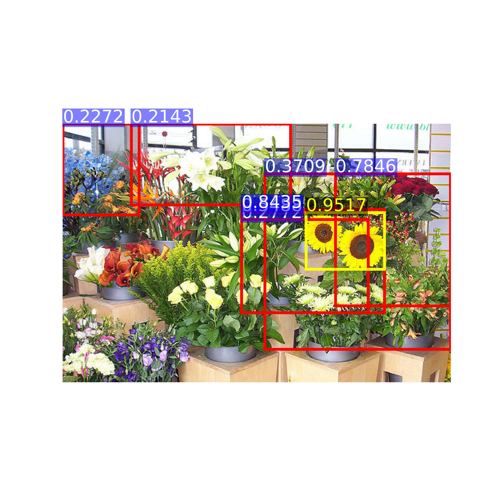
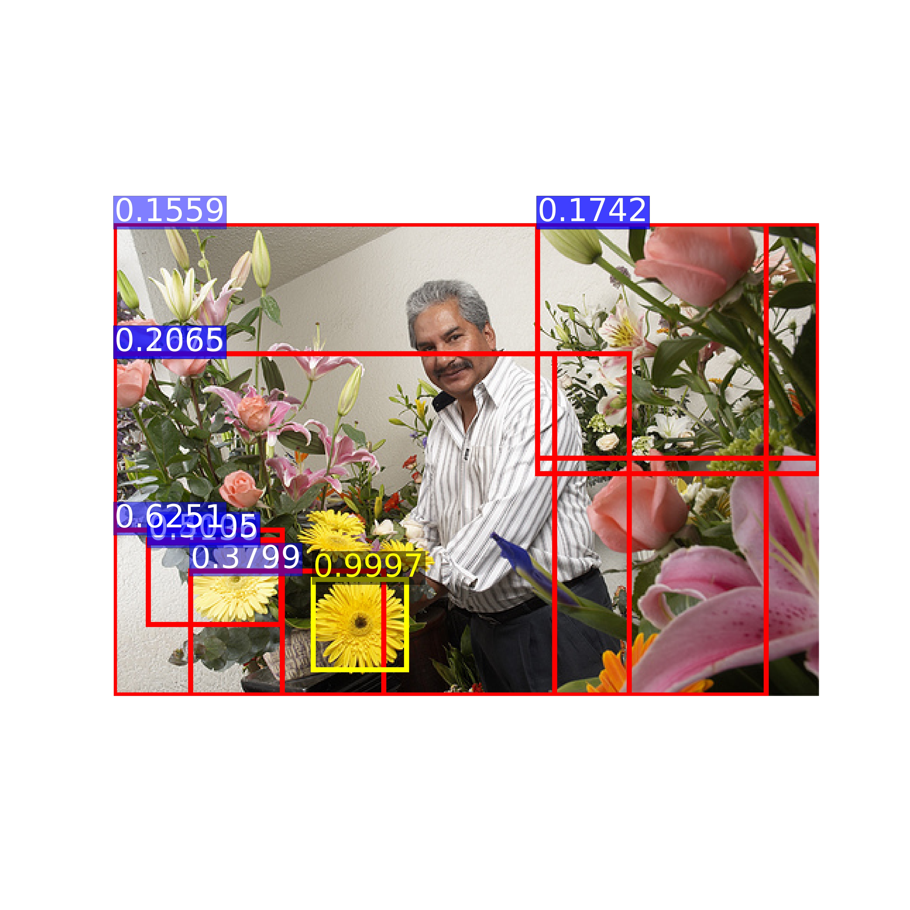
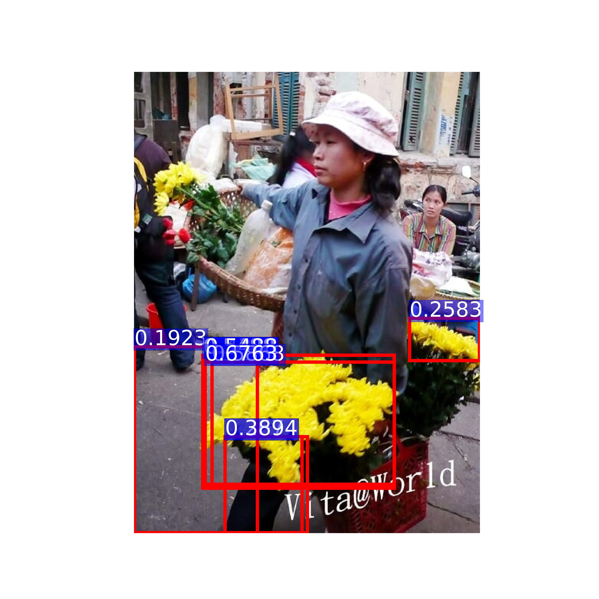

# StackGAN
Framework:

### Dependencies
python 2.7

[TensorFlow 0.11](https://www.tensorflow.org/get_started/os_setup)

[Optional] [Torch](http://torch.ch/docs/getting-started.html#_) is needed, if use the pre-trained char-CNN-RNN text encoder.

[Optional] [skip-thought](https://github.com/ryankiros/skip-thoughts) is needed, if use the skip-thought text encoder.

In addition, please add the project folder to PYTHONPATH and `pip install` the following packages:
- `prettytensor`
- `progressbar`
- `python-dateutil`
- `easydict`
- `pandas`
- `torchfile`
- `caffe`

**Data**
Follow the "Data" process of [StackGAN](https://github.com/SelinaChe/Complex-Object-Detection-StackGAN)

1. Download our preprocessed char-CNN-RNN text embeddings for [birds](https://drive.google.com/open?id=0B3y_msrWZaXLT1BZdVdycDY5TEE) and [flowers](https://drive.google.com/open?id=0B3y_msrWZaXLaUc0UXpmcnhaVmM) and save them to `Data/`.
  - [Optional] Follow the instructions [reedscot/icml2016](https://github.com/reedscot/icml2016) to download the pretrained char-CNN-RNN text encoders and extract text embeddings.
2. Download the [birds](http://www.vision.caltech.edu/visipedia/CUB-200-2011.html) and [flowers](http://www.robots.ox.ac.uk/~vgg/data/flowers/102/) image data. Extract them to `Data/birds/` and `Data/flowers/`, respectively.

**Pretrained Model**
- [StackGAN for birds](https://drive.google.com/open?id=0B3y_msrWZaXLNUNKa3BaRjAyTzQ) trained from char-CNN-RNN text embeddings. Download and save it to `models/`.
- [StackGAN for flowers](https://drive.google.com/open?id=0B3y_msrWZaXLX01FMC1JQW9vaFk) trained from char-CNN-RNN text embeddings. Download and save it to `models/`.
- [StackGAN for birds](https://drive.google.com/open?id=0B3y_msrWZaXLZVNRNFg4d055Q1E) trained from skip-thought text embeddings. Download and save it to `models/` (Just used the same setting as the char-CNN-RNN. We assume better results can be achieved by playing with the hyper-parameters).
- [Image Matching model for Cifar100]( ) (Just download and put it to the the "models" folder)

**Run Demos for Bird**
- Run `sh demo/birds_demo.sh` to generate bird samples from sentences. The results will be saved to `Data/birds/example_captions/`.(Need to [download](https://drive.google.com/file/d/0B0ywwgffWnLLU0F3UHA3NzFTNEE/view) the char-CNN-RNN text encoder for birds to `models/text_encoder/`. Note: this text encoder is provided by [reedscot/icml2016](https://github.com/reedscot/icml2016)).
- Run `sh example_birds.sh` in folder "Region-to-Image_Matching/example". The result images will be stored in folder "match_images"

Examples for birds (char-CNN-RNN embeddings), more on [youtube](https://youtu.be/93yaf_kE0Fg):
  
 

Examples for flowers (char-CNN-RNN embeddings), more on [youtube](https://youtu.be/SuRyL5vhCIM):
  
 

**References**

- StackGAN: Text to Photo-realistic Image Synthesis with Stacked Generative Adversarial Networks [Paper](https://arxiv.org/pdf/1612.03242v1.pdf) [Code](https://github.com/hanzhanggit/StackGAN)
- Selective Search for Object Recognition [Paper](https://www.koen.me/research/selectivesearch/)
- Deep Learning of Binary Hash Codes for Fast Image Retrieval [Paper](http://www.iis.sinica.edu.tw/~kevinlin311.tw/cvprw15.pdf) [Code](https://github.com/kevinlin311tw/caffe-cvprw15)
